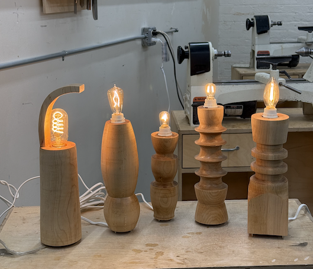

I have this habit of desiring an object, looking online, finding flaws with everything whether with design or execution, saying "whatever, I could just make it," actually making it. That core tenant of my personality is what found me at 7pm in Gowanus, Brooklyn at a woodshop using a lathe for the first time.

 

 

Overhead lighting. General consensus, it's a vibe killer. I had no lamps, every lamp I saw was either too expensive or too cheap or too ugly or made no functionality sense or needed some specialty light bulb or just wasn't my taste. I had woodworked before, in various ways. Hand saws, table saws, CNC even. Made a bench for my parents, made a stool for my plant to sit on (it died), made some bookshelves (I put them up on my wall crooked). I had never used a lathe and I figured this was the perfect time. Turns out turning a block of wood into a smooth cylinder is satisfying in a way I never could've imagined.

 

This was also my first time where I was building from a place of anger. Anger that there are so many objects in the world and most of them are not only ugly but also not all that functional and incredibly uninteresting. 

 

> I believe it's our duty to create beautiful usable useful things in a world that tells us care and intention is inconvenient. Strong belief, strongly held.

 

I made a series of five lamps but my priority was the first lamp from the left. It's different. I envisioned something a big different with this but had to figure out based on some limitations on what was available at the woodshop. Shout out to Lisa for listening to my thoughts and providing some good insights despite the constraints. My original idea was more of a cone wrapping around about 50% of the top surface, like a cupped hand. This was attempt one and like all good things, iteration is key. It would be boring if everything was perfect the first time. The most enjoyable thing, to me, in maybe all aspects of my life, is the process. Feel the materials, test out techniques, make adjustments, repeat. I also wanted to taper the base more, it's very very slight, but once I realized I was enjoying the lathe too much if I went any thinner I wouldn't have been able to attach the second piece.

> Life, like creation, is one long process. Joy exists in the attempt, not in the outcomes.

 

So now I have a lamp. Three lamps (I gave two away to friends). Not perfect but crafted with care, intention, and from a vision within my mind. Feels good, better than buying anything. Take two is coming soon. Keep iterating my friends, greatness is always right around the corner.

 

 
